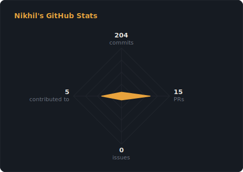

 

<!--STATS:START-->
| **10 yrs** | **15** | **7** | **5** |
|:---|:---|:---|:---|
| shipping software | open source PRs | PRs merged | repos active in recently |
<!--STATS:END-->

### Latest activity 🟠 `auto-updated every 6h`

<!--ACTIVITY:START-->
| repo | | |
|:---|:---|---:|
| `conductor-oss/conductor` | Convert failedWorkflow input to a Map so nested references resolve | `PR open · 1h ago` |
| `kestra-io/kestra` | fix(core): bound the plugin documentation cache to stop unbounded heap growth | `PR open · 2h ago` |
| `conductor-oss/conductor` | Guard pruneExecutions against overflow and non-positive age deleting recent executions | `PR merged · 2h ago` |
| `Netflix/maestro` | Add webhook notification publisher for step/workflow status change events | `PR open · 2h ago` |
<!--ACTIVITY:END-->

### Stack

`java` · `kotlin` · `python` · `typescript` · `spring` · `temporal` · `kafka` · `kubernetes` · `aws` · `mysql` · `dynamodb`

 

 

A soft spot for well-designed state machines.
